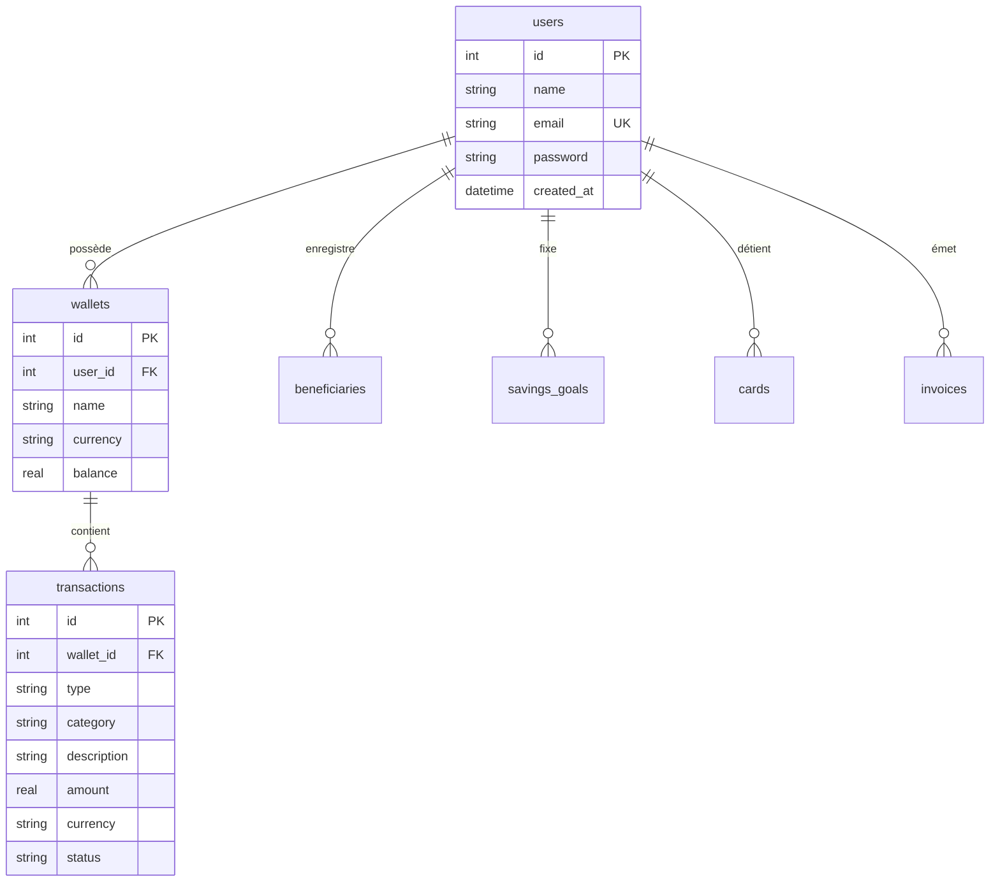

# 🌌 FinFlow - Tableau de Bord Financier Multi-Utilisateur

**FinFlow** est une application web moderne et ultra-sécurisée de gestion de finances personnelles et de flux de trésorerie. Elle propose un écran d'accueil haut de gamme au design Web3 avec des orbes animés flottants, un système de session active robuste, et une gestion de base de données relationnelle SQLite performante.

---

## ✨ Fonctionnalités Clés

### 🔒 1. Authentification Sécurisée & Multi-Utilisateur
* **Écran d'Accueil Premium** : Page d'accueil moderne avec effet de verre dépoli (glassmorphism), grilles technologiques et trois orbes lumineuses colorées qui dérivent en arrière-plan.
* **Sécurité PBKDF2/SHA-512** : Les mots de passe sont hachés et vérifiés de manière robuste à l'aide de l'algorithme natif `crypto` de Node.js.
* **Session Active Persistante** : Gestion des sessions utilisateurs avec sauvegarde sécurisée dans le stockage local du navigateur (`localStorage`).
* **Profil Dynamique & Déconnexion** : Affichage dynamique des initiales et de l'e-mail de l'utilisateur connecté dans la barre latérale avec un bouton de fermeture de session à action immédiate.

### 📊 2. Tableau de Bord Interactif
* **Suivi de Trésorerie en Temps Réel** : Solde total multi-devises (USD, EUR, GBP, JPY), calcul dynamique des revenus mensuels, dépenses et volumes d'échanges.
* **Graphique de Volumes** : Graphique d'analyse mensuelle modélisé pour suivre les flux d'entrées et de sorties d'argent.
* **Convertisseur & Échangeur Réel** : Module d'échange connecté à la base de données. Il permet de sélectionner vos portefeuilles réels, d'obtenir le taux de change, de vérifier que le solde est suffisant et d'effectuer de **vrais transferts d'argent entre vos comptes**.
* **Objectifs d'Épargne** : Définition de budgets cagnottes (acompte maison, voyage, voiture) avec barres de progression colorées et boutons de dépôt rapide (`+$100`).

### 💼 3. Gestion Complète
* **Portefeuille** : Ajout et suppression de comptes bancaires multi-devises.
* **Transactions** : Historique complet avec codes couleurs (Vert pour les entrées, Rouge pour les dépenses) et suppression à la volée avec ajustement automatique des soldes.
* **Bénéficiaires** : Enregistrement de vos tiers pour faciliter les virements.
* **Factures** : Suivi des factures clients avec mise à jour du statut (*payée*, *en attente*, *en retard*).
* **Analytiques** : Calculateur dynamique du taux d'épargne net et répartition en pourcentage des dépenses et des revenus par catégorie.

---

## 🛠️ Stack Technique

* **Frontend** : React.js (Vite), CSS3 Moderne (Variables CSS, Glassmorphism, animations `@keyframes`).
* **Backend** : Node.js, Express.js.
* **Base de Données** : SQLite (via la bibliothèque performante `better-sqlite3`), support complet des clés étrangères et de la suppression en cascade (`ON DELETE CASCADE`).

---

## 💾 Structure de la Base de Données



---

## 🚀 Démarrage Rapide

### 1. Cloner le Projet & Installer les Dépendances
Dans le répertoire du projet, installez l'ensemble des modules nécessaires :
```bash
npm install
```

### 2. Lancer l'API Backend (Port 3001)
Le serveur Express initialise automatiquement le fichier de base de données `finflow.db` s'il n'existe pas :
```bash
node api-server.cjs
```

### 3. Lancer le Client Frontend (Vite)
Dans un autre terminal, démarrez le serveur de développement Vite :
```bash
npm run dev
```

Ouvrez ensuite **[http://localhost:5173/](http://localhost:5173/)** sur votre navigateur web et profitez de FinFlow !
